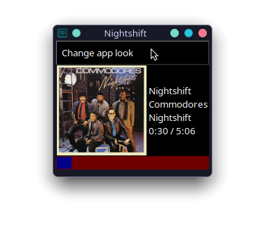
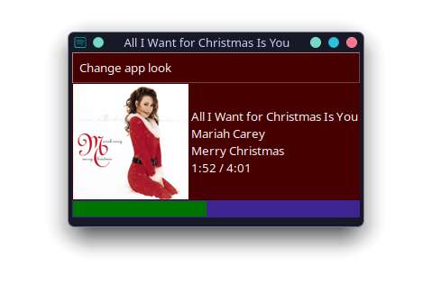
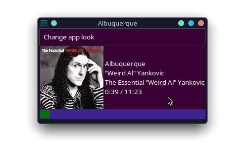

# Custom Spotify Playback Widget

This is a widget created in Python to display your current Spotify playback in a little window in the corner of your screen.

# Setup

## Recommendations

1. Due to how this project is currently set up, it creates a cache directory for album/episode images. This can help with the app's performance, as no threading takes place right now.
    * I may make a "cleanup" script that cleans the cache directory. For now, if you (somehow) find that your storage device is running low on space and a major culprit is the cache directory, just delete everything in there. All of the image files can be redownloaded as needed.
2. If you're running this on a smaller screen, make the image size in [preferences.py](preferences.py) smaller as needed.

## Installation requirements

This script requires Python 3.8+, as well as the following libraries. A full list of required libraries can be found in [requirements.txt](requirements.txt)

```
Pillow>=10.0
spotipy
requests
certifi
urllib3
charset-normalizer
idna
six
redis
```

## Setting up a Spotify application for API access

To get started, you'll need to create an application with Spotify. To do this, follow these steps:

1. Navigate to the [Spotify for Developers Dashboard](https://developer.spotify.com/dashboard)
2. Sign in with your Spotify account, if necessary.
3. Click on "Create app"
4. Give your app any name and description. Under "Redirect URI", spotipy recommends using `https://localhost:3008`. If you have a web server you can use, enter that.
5. Check the **Web API** box under "Which API/SDKs are you planning to use?". This will help ensure your application has API access.

## Setting up the widget to authenticate

After cloning the repository, you'll need to create a `.env` file, preferrably in the root of the cloned repository.

Your .env file should contain the following:

```env
SPOTIPY_CLIENT_ID=<your spotify client ID here>
SPOTIPY_CLIENT_SECRET=<your spotify client secret here>
SPOTIPY_REDIRECT_URI=<whatever URI is set up in your spotify application.>
SPOTIPY_AUTH_SCOPE=user-read-currently-playing user-read-playback-state
```

To get your client ID and secret, go back to the [dashboard](https://developer.spotify.com/dashboard), open the page for your application, and click the Settings button.

Under the "Basic Information" tab, copy the Client ID. Also click on the "View client secret" hyperlink, and copy that into your .env file.

# Configuration

## Cache directory

As it is right now, the cache directory used by the app is hardcoded in `backends/images.py` to one of four directories, depending on your system:

1. Windows: `%LocalAppData%\Temp\spotify-widget`
2. Linux: `~/.cache/spotify-widget`
3. macOS: `~/Library/Caches`
4. Fallback: `<repository path>/backends/.cache`

The fallback is for in case this application is being run on an unrecognised platform.

If you want to change this, replace lines 4-12 in [images.py](backends/images.py) with a custom cache directory.

Example:

```python
cacheDir = "~/.cache/spoti"
```

## Application Preferences

This application has a few things you can customize. You can find these options in [preferences.py](preferences.py), located in the root directory of the repository.

### Window Title Mode

The "Window Title Mode" (`window_title_mode`) preference controls what the application displays on the titlebar of the window.

There are four different "modes" available at the moment:

1. Current playback name (`item`)
    * This mode uses the name of the currently playing item. For example, if you're listening to "Albequerque" by "Weird Al" Yankovic, it'll show "Albequerque" in the titlebar.
2. Current context (`context`)
    * This mode retrieves the current context, if available, from the API and uses the item's name on the title. For example, if you're listening to a song on the album "the penis files", that will be displayed in the titlebar.
3. Custom text (`custom`)
    * This mode uses the associated `custom_title` property, displaying the value of that on the titlebar. If unset, it currently uses your computer's login name. I don't know why I do this.
4. No change (`none`)
    * Self explanatory. Just keeps the default "Custom Spotify Playback Widget" title.

### Image Size

The `img_size` property controls the size at which the application displays the album/show art. It's recomended to set this to a lower value on smaller displays.

### App Theme

The `app_theme` property is used on creation of the main window, to set the main palette of the application. The default is a dark blue colour (#0a325e).

### Progressbar Colour and Relief Styles

The `prog_fill` and `prog_trough` properties control the colours of the progressbar. These can be set to any colour supported by tk. This includes any hex colour. You can find a list of some predefined colours in the preferences file under the Color type alias.

The `prog_relief` and `prog_trough_relief` control the relief styles of the progressbar's filled portion and empty portion, respectively. These can be set to any relief style supported by Tk.

**Note:** These options are **ineffective** on Windows by default. If you wish to customize the progressbar, you'll have to change the Ttk theme manually. You can do this in [gui/window.py](gui/window.py) or the \_\_main\_\_.py script.

Examples:

1. Using gui/window.py:

```python
...
        super().__init__(screenName, baseName, className, useTk, sync, use)
        self.tk_setPalette(preferences.app_theme)
        self.style = ttk.Style(self)
        self.style.theme_use('default')
...
```

2. Using \_\_main\_\_.py:

```python
wind = window.Window(baseName='spotify playback')
wind.style.theme_use('default')
wind.mainloop()
```


*More customisation may come along later on*

# API functions used by this application

This application relies primarily on the [Spotify Web API](https://developer.spotify.com/documentation/web-api), using the [spotipy](https://pypi.org/project/spotipy) library as a wrapper.

To be more specific on the API calls made, here's a list of endpoints and why they're called by this application.

1. `/me/player` - Get Playback State
    * Required permissions: `user-read-playback-state`
2. `/me/player/currently-playing` - Get Currently Playing Track
    * Required permissions: `user-read-currently-playing`
    * Call reason: This call is made to retrieve information about the currently playing track, if any, from the Spotify API. This is then used to display information about the current track's name, artists, and album, as well as its duration.
3. `/playlists/(playlist-id)` - Get Playlist
    * Required permissions: None
    * Call reason: When using the `context` Window Title Mode in preferences.py, the application will make a call to this endpoint to retrieve the playlist's name, if the current playback context is a playlist.
4. `/albums/(album-id)` - Get Album
    * Required permissions: None
    * Call reason: When using the `context` Window Title Mode in preferences.py, the application will make a call to this endpoint to retrieve the album's name, if the current playback context is an album.
5. `/artists/(artist-id)` - Get Artist
    * Required permissions: None
    * Call reason: When using the `context` Window Title Mode in preferences.py, the application will make a call to this endpoint to retrieve the artist's name, if the current playback context is an artist.
6. `/shows/(id)` - Get Show (Podcast)
    * Required permissions: None
    * Call reason: When using the `context` Window Title Mode in preferences.py, the application will make a call to this endpoint to retrieve the show's name, if the current playback context is a show.

# Screenshots







